# TradePilot — Agentic Trading Platform

A multi-module Spring Boot platform that runs **autonomous AI trading agents** backed by Claude or Grok LLMs, with full multi-exchange support for cryptocurrency futures markets.

**Safe defaults are enabled out of the box**: the default exchange provider is **paper**, autonomous order placement stays in **dry-run**, and **mainnet trading is disabled** until explicitly enabled.

## Key Features

### Agentic AI Core
- **Autonomous Agents**: `LLMTradingAgent` and `TechnicalTradingAgent` implement a reactive decision loop (`onKlineClosed → AgentDecision → OrderExecutionGateway`).
- **Agent Lifecycle Management**: Agents transition through IDLE → RUNNING → PAUSED → STOPPED via `AgentManager`; state is persisted and reloaded on restart.
- **Dual LLM Support**: **Claude (Anthropic)** is the default provider; **Grok (xAI)** is available as an alternative. Provider is switchable via `agent.llm.provider`.
- **RAG Architecture**: Trade memories are embedded and stored in **Pinecone** vector DB; relevant context is retrieved per decision cycle.
- **LangChain4j Integration**: Tool-use and chat-memory plumbing via `LangChain4jStrategy`.

### Multi-Exchange Support
- **Bybit Futures** (✅ Recommended for Testing): Full V5 API, real execution, testnet-ready.
- **Binance Futures**: Mainnet support.
- **dYdX v4**: Market data; order execution is mocked (safe for navigation).
- **Hyperliquid** (✅ New): Full REST + WebSocket market data and **EIP-712 order signing** for live DEX execution. Testnet flag: `exchange.hyperliquid.use-testnet=true`.
- **Paper Trading**: Fully simulated fills, margin, and position changes — the default.

### Architecture
- **Multi-Module**: `gateway/` (Spring Cloud Gateway, :8080) + `backend-core/` (Spring Boot, :8081 / gRPC :9090).
- **Event-Driven**: Apache Kafka for signals, executions, risk events, and market data.
- **Resilience**: Circuit breakers and rate limiters via Resilience4j on all exchange interactions.
- **Auth**: JWT authentication and refresh-token rotation; rate limiting via Bucket4j + Redis.

---

## Project Status

| Component | Status | Notes |
|-----------|--------|-------|
| **Bybit Integration** | 🟢 Ready | Mainnet & Testnet V5 API. |
| **Binance Integration** | 🟡 Mainnet Only | Hardcoded to Mainnet URLs. |
| **dYdX Integration** | 🟠 Partial | Market data only; trade execution is mocked. |
| **Hyperliquid Integration** | 🟢 Ready | REST + WebSocket + EIP-712 signing. Defaults to testnet. |
| **LLM Agents (Claude)** | 🟢 Default | Claude Sonnet is the active provider. |
| **LLM Agents (Grok)** | 🟡 Disabled | Available; set `agent.llm.provider=grok` and supply `GROK_API_KEY`. |
| **RAG / Memory** | 🟢 Beta | Pinecone vector DB integration implemented. |
| **Backtesting** | 🟢 Ready | CSV-driven backtest loop with metrics and equity curve export. |

---

## Quick Start (Safe Local Mode)

The default runtime is intentionally conservative:

- `server.port=8081`
- `trading.execution.mode=paper`
- `trading.exchange.provider=paper`
- `rag.order.dry-run=true`
- `trading.live.enabled=false`

### 1. Prerequisites
- Java 21 LTS
- Docker & Docker Compose

### 2. Configuration
Copy `.env.example` to `.env`:

```properties
SERVER_PORT=8081
GATEWAY_PORT=8080
TRADING_EXECUTION_MODE=paper
TRADING_EXCHANGE_PROVIDER=paper
TRADING_LIVE_ENABLED=false
JWT_SECRET=your-secret-here
ANTHROPIC_API_KEY=your-claude-key
```

### 3. Run Dependencies + Services
```bash
docker-compose up -d
```

This starts: `tradepilot-gateway` (:8080), `tradepilot-core` (:8081), PostgreSQL (:5432), Redis (:6379), Kafka (:9092), Zookeeper (:2181).

### 4. Start the Backend Standalone (alternative)
```bash
./gradlew :backend-core:bootRun
```

### 5. Access

- API Gateway: `http://localhost:8080`
- Backend direct: `http://localhost:8081`
- OpenAPI / Swagger UI: `http://localhost:8081/swagger-ui.html`
- Agent API: `/api/v1/agents`
- Bot operational API: `/api/v1/bots`

### Bybit Testnet Execution

```properties
SPRING_PROFILES_ACTIVE=live
TRADING_EXECUTION_MODE=live
TRADING_EXCHANGE_PROVIDER=bybit
TRADING_BYBIT_DOMAIN=TESTNET_DOMAIN
TRADING_BYBIT_API_KEY=YOUR_TESTNET_KEY
TRADING_BYBIT_API_SECRET=YOUR_TESTNET_SECRET
```

### Mainnet Execution (Explicit Opt-In Only)

All of the following must be set:

```properties
SPRING_PROFILES_ACTIVE=prod,live
TRADING_EXECUTION_MODE=live
TRADING_EXCHANGE_PROVIDER=binance   # or bybit
TRADING_BYBIT_DOMAIN=MAINNET_DOMAIN # only when provider=bybit
TRADING_LIVE_ENABLED=true
TRADING_BINANCE_API_KEY=...
TRADING_BINANCE_API_SECRET=...
```

If `TRADING_LIVE_ENABLED=true` is not set, mainnet providers are rejected during startup.

---

## API Reference

### Agent API (`/api/v1/agents`)

Agents are the primary abstraction. Create, configure, and lifecycle-manage autonomous trading agents.

```http
POST   /api/v1/agents              # Create a new agent
GET    /api/v1/agents              # List all agents (paginated)
GET    /api/v1/agents/{id}         # Get agent details
GET    /api/v1/agents/{id}/performance  # Get performance metrics
POST   /api/v1/agents/{id}/activate    # Start the agent (IDLE → RUNNING)
POST   /api/v1/agents/{id}/pause       # Pause the agent (RUNNING → PAUSED)
DELETE /api/v1/agents/{id}             # Delete the agent
```

### Bot Operational API (`/api/v1/bots`)

Legacy API surface for lower-level bot operations (start, stop, configure, leverage, sentiment). Routes through to agent-layer internals.

```http
POST   /api/v1/bots                        # Create
POST   /api/v1/bots/{botId}/start          # Start
PUT    /api/v1/bots/{botId}/stop           # Stop
GET    /api/v1/bots/{botId}/status         # Status
POST   /api/v1/bots/{botId}/configure      # Configure
POST   /api/v1/bots/{botId}/leverage       # Set leverage
POST   /api/v1/bots/{botId}/sentiment      # Set sentiment
GET    /api/v1/bots                        # List all
DELETE /api/v1/bots/{botId}               # Delete
```

### Orders API (`/api/v1/orders`)

```http
POST   /api/v1/orders              # Create order
GET    /api/v1/orders              # List orders
GET    /api/v1/orders/{id}         # Get order
PUT    /api/v1/orders/{id}         # Update order
DELETE /api/v1/orders/{id}         # Cancel order
```

---

## Testing

### Unit & Integration Tests
```bash
./gradlew :backend-core:test
```

### Gateway Tests
```bash
./gradlew :gateway:test
```

### HTTP Scripts
The `api-tests/` directory contains HTTP scripts for direct endpoint testing:
- `api-tests/backend-api-test.sh`
- `api-tests/agent-api-tests.http`

---

## Architecture Overview

### Package & Component Mind Map

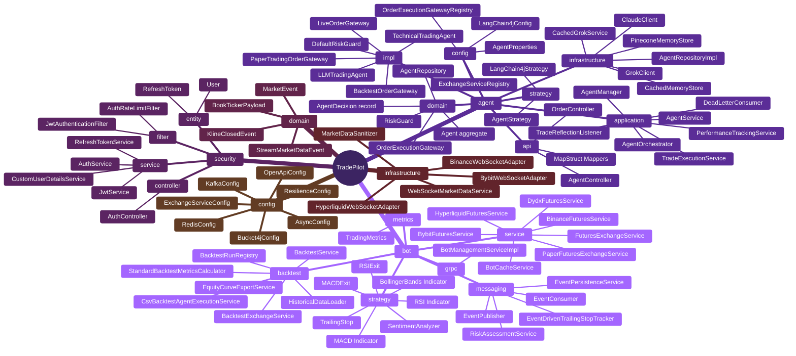

### Module Layout

```
tradepilot/
├── gateway/          Spring Cloud Gateway — JWT auth, CORS, routing (:8080)
└── backend-core/     Trading platform — agents, orders, exchange, events (:8081 / gRPC :9090)
```

### High-Level Architecture

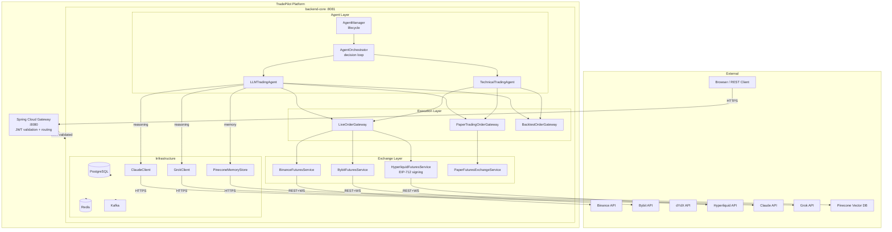

### Agent Lifecycle

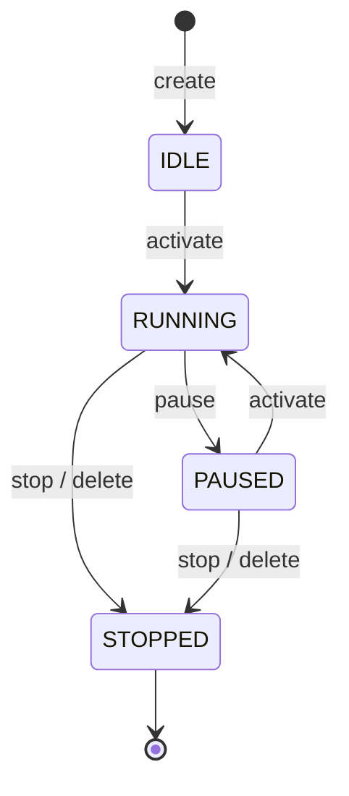

---

## Configuration Reference

| Property | Default | Description |
|----------|---------|-------------|
| `server.port` | `8081` | Backend HTTP port |
| `trading.execution.mode` | `paper` | Execution gateway (`paper`, `live`) |
| `trading.exchange.provider` | `paper` | Exchange adapter (`paper`, `bybit`, `binance`, `hyperliquid`) |
| `trading.live.enabled` | `false` | Required before any mainnet exchange access |
| `trading.bybit.domain` | `TESTNET_DOMAIN` | Bybit environment |
| `agent.llm.provider` | `claude` | Active LLM (`claude`, `grok`) |
| `agent.llm.claude.model` | `claude-sonnet-4-6` | Claude model ID |
| `agent.llm.claude.enabled` | `true` | Enable Claude provider |
| `agent.llm.grok.enabled` | `false` | Enable Grok provider |
| `agent.llm.cache.enabled` | `false` | Cache LLM responses (dev/backtest) |
| `agent.orchestrator.enabled` | `true` | Enable decision loop |
| `agent.orchestrator.loop-interval` | `30000` | Loop interval ms |
| `agent.strategy` | `none` | Strategy override (`none`, `langchain4j`) |
| `exchange.hyperliquid.use-testnet` | `true` | Hyperliquid testnet flag |
| `rag.enabled` | `true` | Enable RAG memory pipeline |
| `rag.order.dry-run` | `true` | Log AI orders without sending to exchange |
| `rag.order.max-position-size-percent` | `10` | Max LLM-driven position size % |
| `rag.order.default-leverage` | `1` | Default leverage for AI orders |
| `rag.embedding.provider` | `openai` | Embedding provider (`openai`, `grok`, `local`) |
| `rag.vector-db.provider` | `pinecone` | Vector DB provider |

---

## Hard Risk Limits

- **Paper-first default**: new agents run in paper mode unless explicitly switched.
- **Dry-run AI execution**: `rag.order.dry-run=true` by default.
- **Position-size cap**: `rag.order.max-position-size-percent=10`.
- **Default leverage**: `rag.order.default-leverage=1`.
- **Live gateway guardrails**: minimum margin balance enforced; bracket exits auto-placed (2% SL / 5% TP).
- **Mainnet lock**: mainnet providers are blocked unless `trading.live.enabled=true`.

### Restart Behavior

Agent definitions are persisted. Agents previously `RUNNING` are restarted by `AgentManager` on startup. Exchange-side position reconciliation is still manual — verify open positions before re-enabling non-paper execution after an unclean shutdown.

---

## Deployment

### Docker Compose

```bash
docker-compose up -d
```

Starts all services: gateway (:8080), backend-core (:8081 / gRPC :9090), PostgreSQL, Redis, Kafka, Zookeeper.

### Kubernetes

```bash
kubectl apply -f redis-deployment.yaml
kubectl apply -f redis-service.yaml
kubectl apply -f deployment.yaml
kubectl apply -f service.yaml
```

```bash
kubectl port-forward service/simple-trading-bot 8081:8081
```

### Docker Image Build (Multi-Stage)

```bash
docker build -t tradepilot-core ./backend-core
```

---

## Documentation

<details>
<summary><strong>1. High-Level System Overview</strong></summary>

```mermaid
graph TB
    classDef backtest fill:#fff3e0,stroke:#e65100,color:#3e2723

    subgraph Clients["External Clients"]
        UI[Web / Mobile UI]
        GRPC[gRPC Client]
    end

    subgraph TradePilot["TradePilot — backend-core"]
        subgraph API["API Layer"]
            AC[AgentController]
            OC[OrderController]
            AUTH[AuthController]
            EDC[EventDrivenTradingController]
            BTC[BacktestController]:::backtest
        end

        subgraph Core["Agent Core"]
            AO[AgentOrchestrator]
            AS[AgentService]
            TES[TradeExecutionService]
            PTS[PerformanceTrackingService]
            AM[AgentManager]
            CMS[CachedMemoryStore]
        end

        subgraph Execution["Execution Layer"]
            GR[OrderExecutionGatewayRegistry]
            LGW[LiveOrderGateway]
            PGW[PaperTradingOrderGateway]
            BGW[BacktestOrderGateway]:::backtest
        end

        subgraph Strategy["Strategy & LLM"]
            LC4J[LangChain4jStrategy]
            LLM["LLMProvider\nGrok or Claude"]
            CGS["CachedGrokService\nLLM response cache"]:::backtest
        end

        subgraph BotDomain["Bot Domain"]
            subgraph MarketData["Market Data"]
                WS[WebSocketMarketDataService]
                BWS[BinanceWebSocketAdapter]
                BYWWS[BybitWebSocketAdapter]
                HLWS[HyperliquidWebSocketAdapter]
            end

            subgraph ExchangeServices["Exchange Services"]
                ESR[ExchangeServiceRegistry]
                BIN[BinanceFuturesService]
                BYB[BybitFuturesService]
                DYD[DydxFuturesService]
                HL[HyperliquidFuturesService]
                PAP[PaperFuturesExchangeService]
                BEXS[BacktestExchangeService]:::backtest
            end

            subgraph Messaging["Event Bus — Kafka"]
                EP[EventPublisher]
                EC[EventConsumer]
                EPS[EventPersistenceService]
            end

            subgraph BacktestDomain["Backtest"]
                BS[BacktestService]:::backtest
                CBAES[CsvBacktestAgentExecutionService]:::backtest
                HDL[HistoricalDataLoader]:::backtest
                BRR[BacktestRunRegistry]:::backtest
                SBMC[StandardBacktestMetricsCalculator]:::backtest
                ECES[EquityCurveExportService]:::backtest
            end

            BCS[BotCacheService]
            GRPCSVC["BotManagementServiceImpl\ngRPC"]
        end

        subgraph Security["Security"]
            JF[JwtAuthenticationFilter]
            JS[JwtService]
            AUTHS[AuthService]
        end

        subgraph Persistence["Persistence"]
            DB[(PostgreSQL)]
            CACHE[(Redis)]
            AGENTREPO[AgentRepository]
            ORDERREPO[OrderRepository]
        end

        subgraph Infra["Infrastructure"]
            KAFKA[(Kafka)]
            TM["TradingMetrics\nPrometheus/Micrometer"]
        end
    end

    subgraph Exchanges["External Exchanges"]
        BINE[Binance Futures]
        BYBE[Bybit Futures]
        DYDE[dYdX v4]
        HLE[Hyperliquid]
        CSV[(CSV Files)]:::backtest
    end

    UI -->|REST / JWT| API
    GRPC -->|gRPC| GRPCSVC

    AUTH --> AUTHS --> JS
    JF --> JS

    AC --> AS --> AGENTREPO --> DB
    AC --> AO
    OC --> ORDERREPO
    AM -->|loads on startup| AO
    AM --> AGENTREPO

    AO -->|sense| WS
    BWS & BYWWS & HLWS --> WS
    AO -->|think| LC4J --> LLM
    AO -->|act| GR
    GR --> LGW & PGW & BGW

    LGW --> ESR --> BIN & BYB & DYD & HL & PAP
    PGW --> PAP
    BIN --> BINE
    BYB --> BYBE
    DYD --> DYDE
    HL --> HLE

    BGW --> BEXS

    BTC --> BS
    BTC -->|query runs| BRR
    BTC -->|download CSV| ECES
    BS --> HDL
    HDL --> CSV & DB
    BS --> CBAES
    BS -->|create with latency/slippage/fee| BEXS
    CBAES -->|per candle via LLMTradingAgent| CGS
    CBAES -->|setMarketContext per candle| BEXS
    CBAES --> BGW
    BGW -->|place order| BEXS
    BEXS -->|OrderResult| BGW
    CBAES -->|ExecutionResult| SBMC
    SBMC -->|BacktestMetrics| BS
    BS -->|save| BRR

    AO --> TES --> ORDERREPO --> DB
    TES --> PTS --> DB
    GRPCSVC --> BCS
    TES --> EP --> KAFKA
    KAFKA --> EC
    EC --> EPS --> DB

    AS -->|cache agentsByOwner| CACHE
    BCS -->|BotState| CACHE
    CGS -->|LLM response cache| CACHE
    CMS -->|trade memory| CACHE
    PTS --> DB
    AO -->|record order latency| TM
```

</details>

<details>
<summary><strong>2. Agent Domain — DDD Layers</strong></summary>

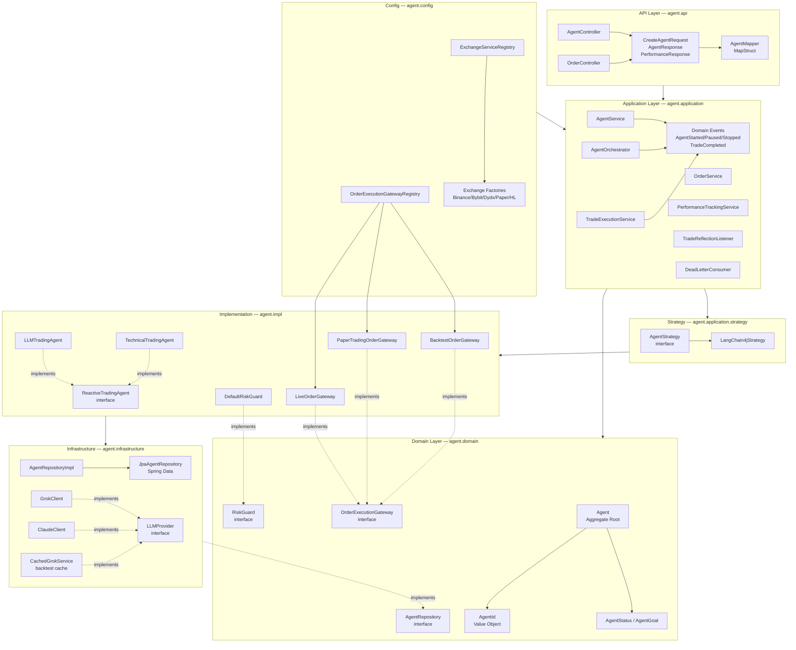

</details>

<details>
<summary><strong>3. Order Execution Pipeline</strong></summary>

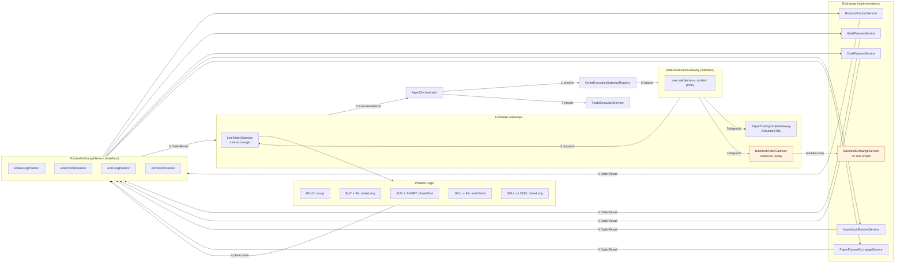

</details>

<details>
<summary><strong>4. Reactive Sense–Think–Act Loop</strong></summary>

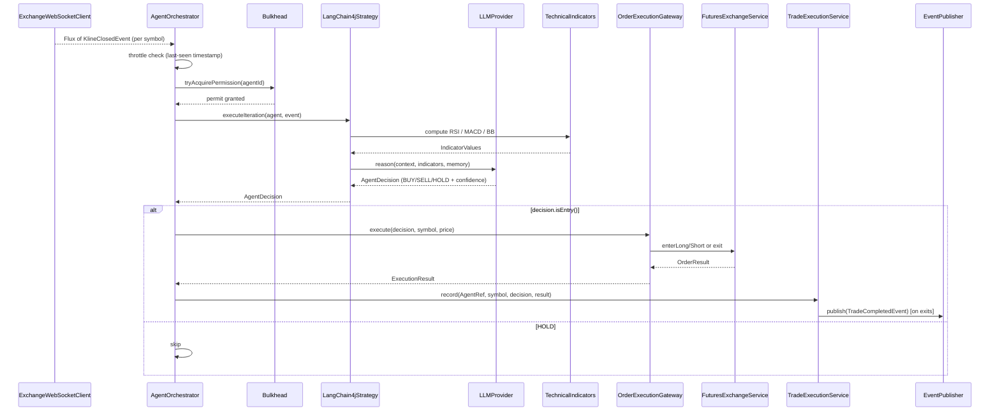

</details>

<details>
<summary><strong>5. Event-Driven Architecture — Kafka</strong></summary>

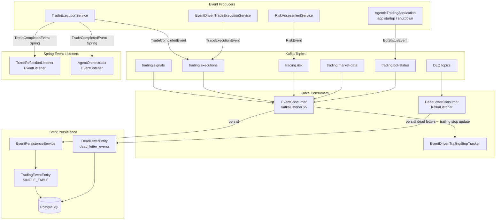

</details>

<details>
<summary><strong>6. Security Architecture</strong></summary>

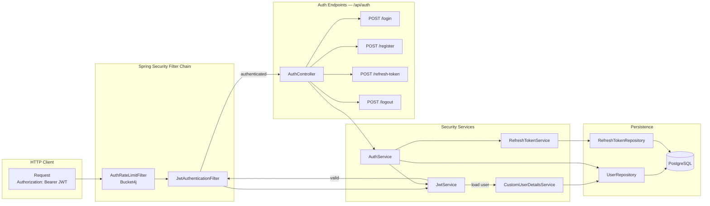

</details>

<details>
<summary><strong>7. Backtest Architecture</strong></summary>

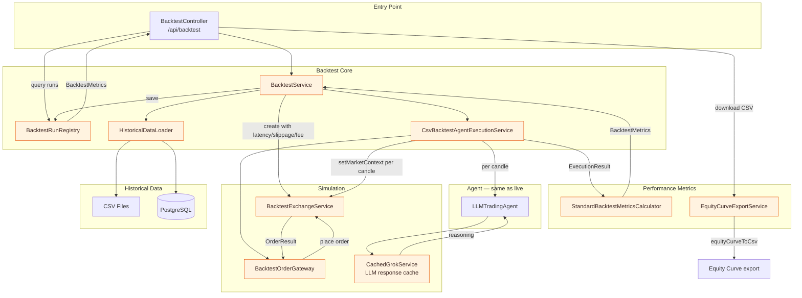

</details>

<details>
<summary><strong>8. Market Data Ingestion</strong></summary>

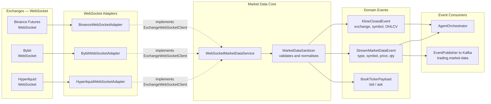

</details>

<details>
<summary><strong>9. Agent Lifecycle — State Machine</strong></summary>

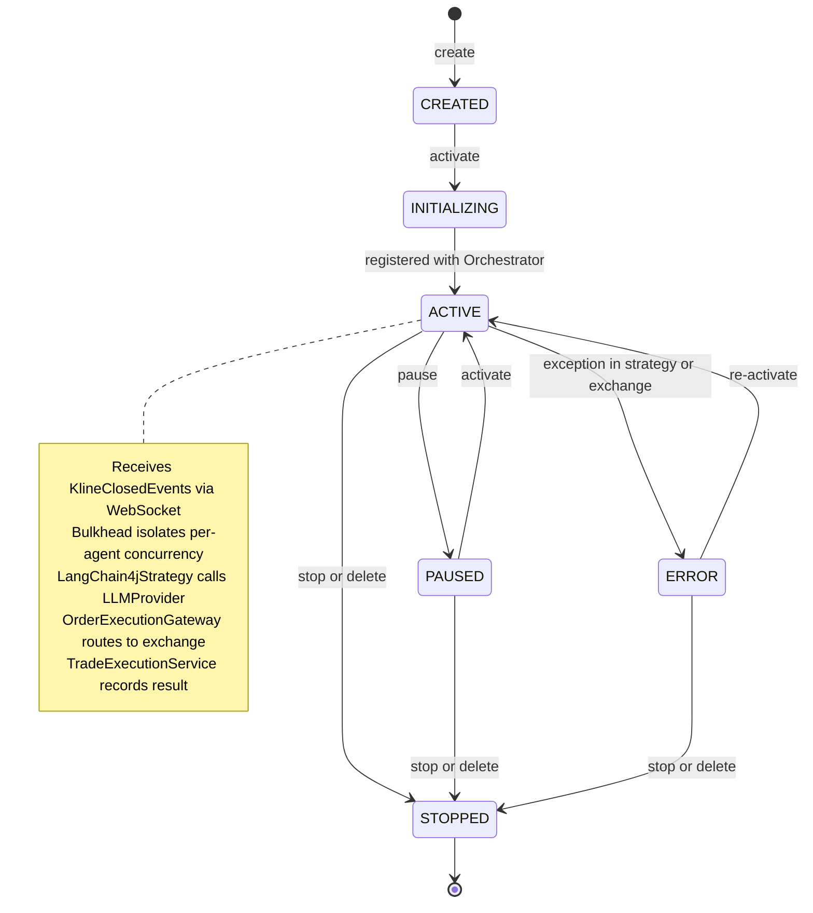

</details>

<details>
<summary><strong>10. Component Dependency Summary</strong></summary>

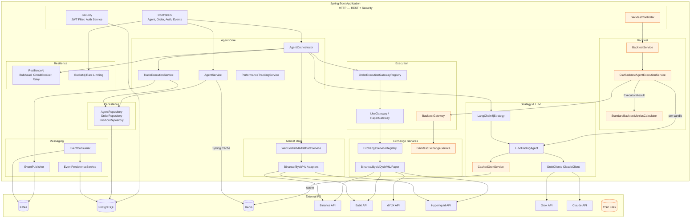

</details>

### Trade Execution Dataflow

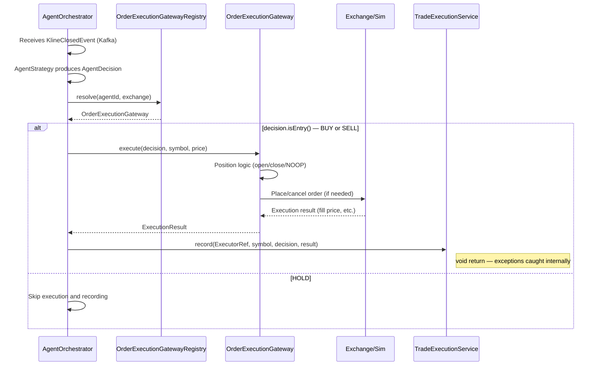

### System Context

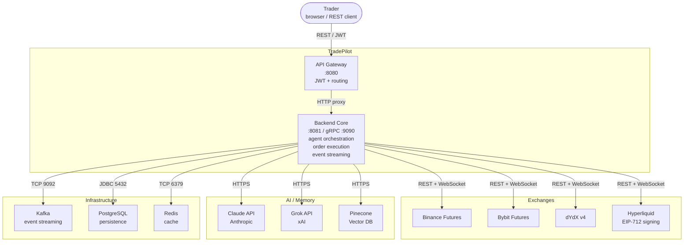

### Deployment Topology

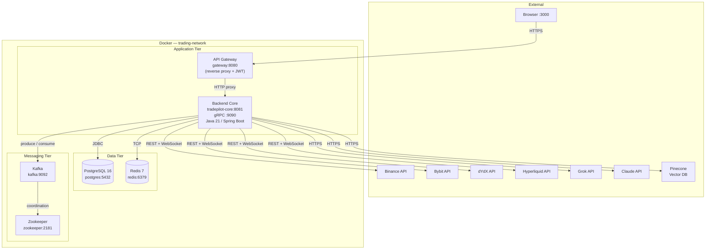

### Persistence Schema (ERD)

```mermaid
erDiagram
    USERS {
        string id PK
        string username UK
        string email UK
        string password
        string account_tier
        int max_bots
        int max_leverage
        string oauth_provider
        instant created_at
    }
    AGENTS {
        string id PK
        string owner_id FK
        string name UK
        string trading_symbol
        double capital
        string status
        string execution_mode
        string exchange_name
        string goal_type
        instant created_at
        instant last_active_at
    }
    ORDERS {
        string id PK
        string executor_id FK
        string executor_type
        string symbol
        string direction
        string status
        double price
        double quantity
        double realized_pnl
        instant created_at
        instant executed_at
    }
    POSITIONS {
        string id PK
        string agent_id FK
        string main_order_id FK
        string symbol
        string direction
        double entry_price
        double quantity
        double exit_price
        double realized_pnl
        string status
        instant opened_at
        instant closed_at
    }
    AGENT_PERFORMANCE {
        string agent_id PK_FK
        int total_trades
        int winning_trades
        double total_pnl
        double win_rate
        double sharpe_ratio
        double max_drawdown
        instant last_updated
    }
    TRADING_EVENTS {
        string id PK
        string event_id UK
        string event_type
        string bot_id
        string symbol
        instant timestamp
    }
    DEAD_LETTER_EVENTS {
        string id PK
        string original_topic
        int partition
        long kafka_offset
        string exception_type
        boolean resolved
        instant received_at
    }

    USERS ||--o{ AGENTS : "owns"
    AGENTS ||--o{ ORDERS : "places"
    AGENTS ||--o{ POSITIONS : "holds"
    AGENTS ||--|| AGENT_PERFORMANCE : "tracked by"
    TRADING_EVENTS ||--o{ TRADING_EVENTS : "carries metadata"
```

### Class Hierarchy (Interfaces & Implementations)

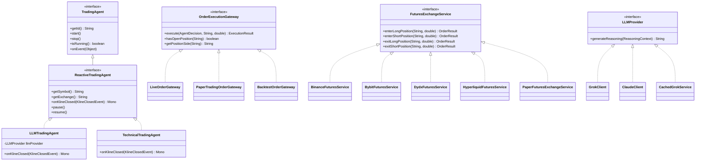

### PRD & Background

See [docs/FuturesTradingBotPRD.md](./docs/FuturesTradingBotPRD.md) for the requirements baseline and agent architecture details.

---

## Contributing

1. Fork the repository
2. Create your feature branch (`git checkout -b feature/amazing-feature`)
3. Commit your changes
4. Push and open a Pull Request

---

## Disclaimer

This project is for educational purposes only. Leveraged trading can result in total loss of capital. Validate all strategies in paper mode or exchange testnet environments before considering any live deployment.
